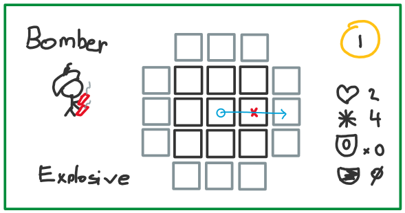

## Bomber

## Description
Limited movement and blows up.

## Design intention
This should be a low cost unit that has a very telegraphed attack pattern. It is easy to counter but must be countered or otherwise suffer a devastating attack.
## Notes or implementation details
Explosive, blows itself up and everything adjacent to it.